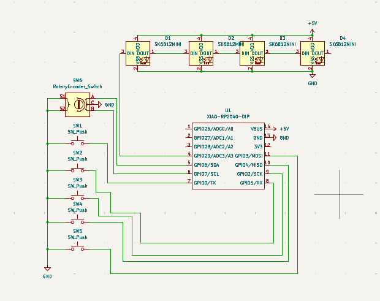
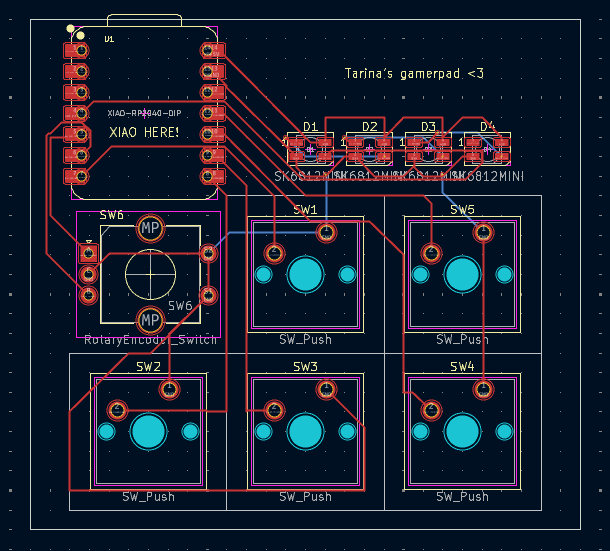
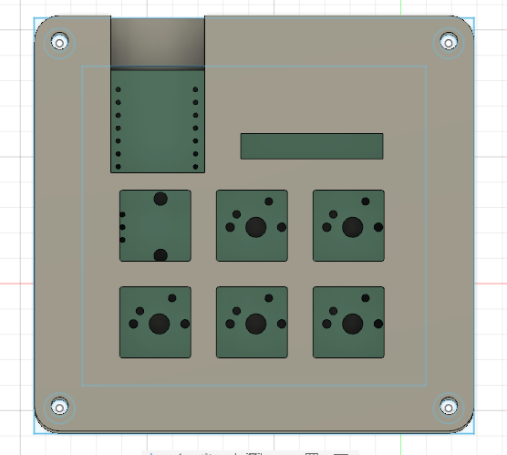
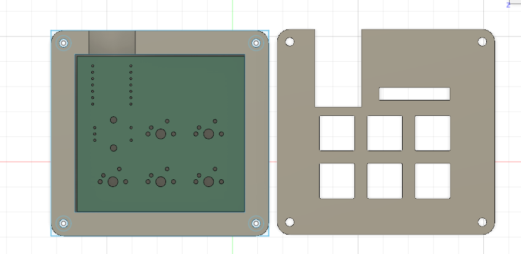

# Tarina-s-gamerpad
simple wasd keypad with volume control, led lights and a special key
## Design Process
i wanted to make a keyboard that i could use so i thought i should make a wasd keypad that i can use to ply games. the process was very long and tiring but it was kinda fun. i thought to add extra stuff like leds, a volume knob and an extra key just because i didnt want it to be basic.

## PCB
here is a picture of my schematics

it didnt take too long for me to put this together since i had the guide to help me out.
here is a picture of my pcb :

i had practiced using kiCAD beforehand so creating the pcb wasnt such a hard process

## Case
i made the case using fusion360 and it took so long and was not hard but my computer kept lagging so it was kind of annoying but i am so glad i had the guide to help out and make the process easier.

here is a picutre of my case:

## BOM
- 5x Cherry MX Switches
- 4x SK6812 MINI LEDS
- 1x XIAO RP2040
- 5x Blank DSA Keycaps
- 1x EC11 Rotary Encoder
- 1x Case (top and base)
- 4x M3x16 Bolt
- 4x M3 heatset

## Overview
this is my first electronics project  and i think i did a decent job idk T_T but it was really challenging but fun to do, a great learning experience and i kinda want to do more.